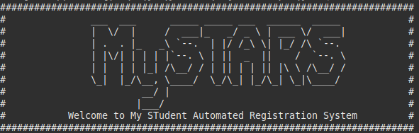

# STudent-Automated-Registration-System
CZ2002 - Object Oriented Design &amp; Programming (Project)

This is a console application which mimics the working of NTU Stars Planner. 

## Functional Requirements

### Student
1. Add Course
2. Drop Course
3. Check/Print Courses Registered
4. Check Vacancies Available
5. Change Index Number of Course
6. Swop Index Number with Another Student

### Admin
1. Edit student access period
2. Add a student (name, matric number, gender, nationality, etc)
3. Add/Update a course (course code, school, its index numbers and vacancy).
4. Check available slot for an index number (vacancy in a class)
5. Print student list by index number.
6. Print student list by course (all students registered for the selected course). 